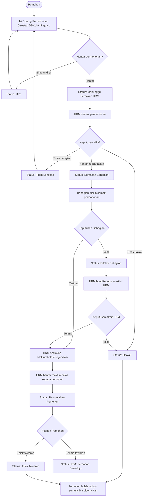
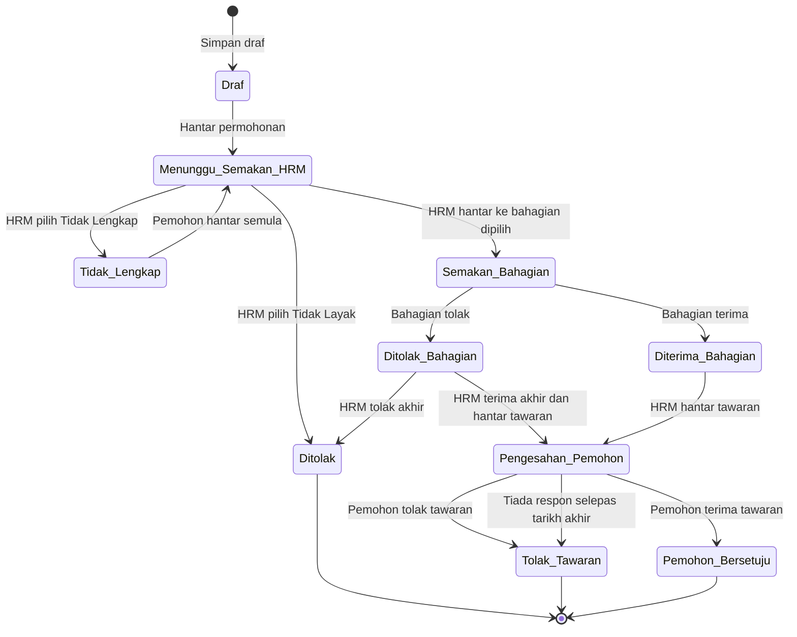
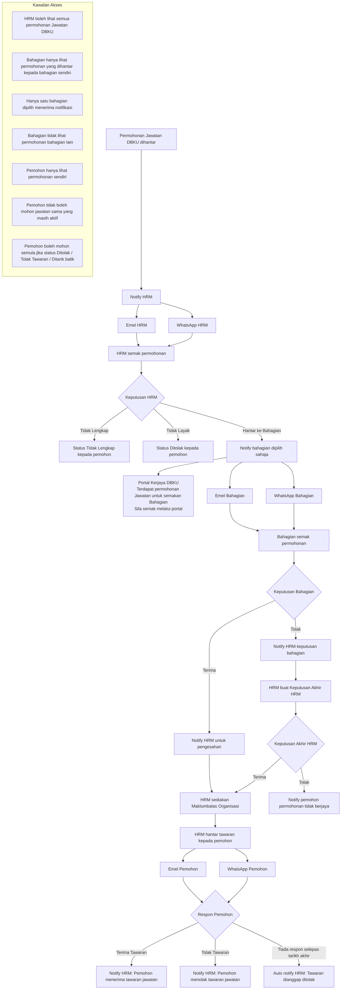
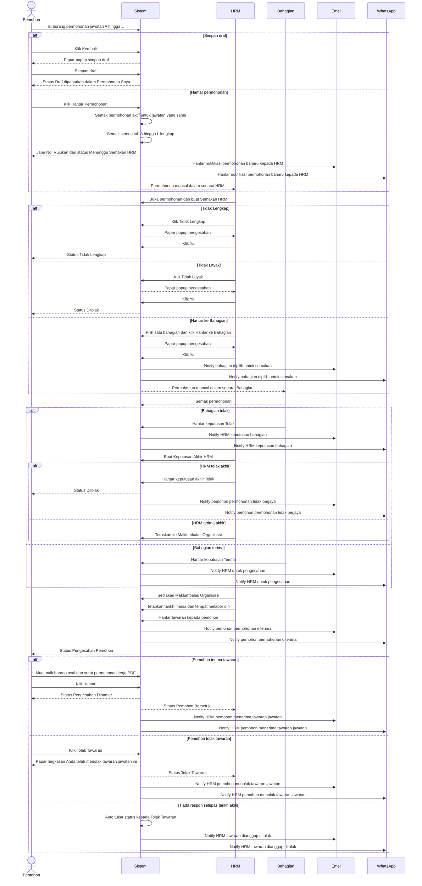

# Modul Permohonan Jawatan DBKU

Dokumen ini menyenaraikan lima rajah Mermaid untuk menerangkan aliran Modul Permohonan Jawatan DBKU.

## 1. Flow Ringkas Modul Jawatan DBKU

## 2. Flow Lengkap Proses Permohonan Jawatan DBKU

```mermaid
flowchart TD
  Start([Mula]) --> ApplyBtn[Klik Mohon Jawatan DBKU]
  ApplyBtn --> Eligibility{Ada permohonan aktif untuk jawatan yang sama?}

  Eligibility -->|Ya| Block[Permohonan baru disekat]
  Block --> BlockReason[Draf / Menunggu semakan / Semakan bahagian / Pengesahan pemohon masih aktif]

  Eligibility -->|Tidak| Form[Borang Permohonan Jawatan DBKU]
  Form --> Tabs[Isi semua tab A hingga L]
  Tabs --> Back{Klik Kembali sebelum hantar?}

  Back -->|Ya| DraftPopup[Popup simpan draf]
  DraftPopup --> DraftText[Maklumat yang telah diisi akan disimpan sebagai draf dan dipaparkan dalam Permohonan Saya.]
  DraftText --> SaveDraft[Simpan draf]
  SaveDraft --> DraftStatus[Status: Draf]
  DraftStatus --> ContinueDraft[Teruskan Draf]
  ContinueDraft --> Form

  Back -->|Tidak| Submit[Klik Hantar Permohonan]
  Tabs --> Submit
  Submit --> Validate{Semua tab wajib lengkap?}
  Validate -->|Tidak| MissingTab[Buka tab pertama yang belum lengkap]
  MissingTab --> Tabs

  Validate -->|Ya| GenerateRef[No. Rujukan dijana]
  GenerateRef --> RefExample[Contoh: PK.2026-0007]
  RefExample --> SubmittedStatus[Status: Menunggu Semakan HRM]

  SubmittedStatus --> NotifyHRM[Notify HRM permohonan baharu]
  NotifyHRM --> HRMReview[HRM buat Semakan HRM]
  HRMReview --> HRMPopup{Popup pengesahan tindakan HRM}

  HRMPopup -->|Hantar ke Bahagian| HRMDecisionSend[Ya, hantar ke bahagian dipilih]
  HRMPopup -->|Tidak Lengkap| HRMDecisionIncomplete[Ya, tandakan Tidak Lengkap]
  HRMPopup -->|Tidak Layak| HRMDecisionReject[Ya, tandakan Tidak Layak]

  HRMDecisionIncomplete --> Incomplete[Status: Tidak Lengkap]
  Incomplete --> ApplicantUpdate[Pemohon kemaskini maklumat atau dokumen]
  ApplicantUpdate --> SubmittedStatus

  HRMDecisionReject --> Rejected[Status: Ditolak]

  HRMDecisionSend --> SelectedDept[HRM pilih satu bahagian sahaja]
  SelectedDept --> DeptReviewStatus[Status: Semakan Bahagian]
  DeptReviewStatus --> NotifyDept[Notify bahagian dipilih sahaja]
  NotifyDept --> DeptReview[Bahagian semak permohonan]
  DeptReview --> DeptDecision{Keputusan Bahagian}

  DeptDecision -->|Tolak| DeptRejected[Status: Ditolak Bahagian]
  DeptRejected --> NotifyHRMDecision[Notify HRM keputusan bahagian]
  NotifyHRMDecision --> HRMFinal[HRM buat Keputusan Akhir HRM]
  HRMFinal --> FinalDecision{Keputusan Akhir HRM}
  FinalDecision -->|Tolak| FinalRejected[Status: Ditolak]
  FinalRejected --> NotifyApplicantRejected[Notify pemohon permohonan tidak berjaya]
  FinalDecision -->|Terima| OrgFeedback

  DeptDecision -->|Terima| DeptAccepted[Status: Diterima Bahagian]
  DeptAccepted --> NotifyHRMConfirm[Notify HRM untuk pengesahan]
  NotifyHRMConfirm --> OrgFeedback[HRM sediakan Maklumbalas Organisasi]

  OrgFeedback --> OfferLetterText[Isi maklumat tawaran jawatan]
  OfferLetterText --> ReportDetails[Tetapkan tarikh, masa dan tempat melapor diri]
  ReportDetails --> ConfirmationDeadline[Tetapkan tarikh akhir pengesahan pemohon]
  ConfirmationDeadline --> SendToApplicant[Hantar ke Pemohon]

  SendToApplicant --> NotifyApplicantOffer[Notify pemohon tawaran diterima]
  NotifyApplicantOffer --> ApplicantConfirmation[Status: Pengesahan Pemohon]
  ApplicantConfirmation --> ResponseCheck{Pemohon respon sebelum tarikh akhir?}

  ResponseCheck -->|Tidak| AutoReject[Auto status: Tolak Tawaran]
  ResponseCheck -->|Ya| ApplicantChoice{Pilihan Pemohon}

  ApplicantChoice -->|Tolak Tawaran| RejectOffer[Status: Tolak Tawaran]
  RejectOffer --> NotifyHRMRejectOffer[Notify HRM pemohon menolak tawaran]

  ApplicantChoice -->|Terima Tawaran| UploadConfirm[Pemohon muat naik borang asal dan surat permohonan kerja PDF]
  UploadConfirm --> SubmitConfirm[Klik Hantar]
  SubmitConfirm --> ApplicantSent[Status Pemohon: Pengesahan Dihantar]
  SubmitConfirm --> HRMAgreed[Status HRM: Pemohon Bersetuju]
  HRMAgreed --> NotifyHRMAcceptOffer[Notify HRM pemohon menerima tawaran]

  Rejected --> Reapply[Permohonan jawatan yang sama boleh dibuat semula jika status membenarkan]
  FinalRejected --> Reapply
  RejectOffer --> Reapply
  AutoReject --> Reapply
  NotifyHRMAcceptOffer --> End([Selesai])
  NotifyHRMRejectOffer --> End
  NotifyApplicantRejected --> End
```

## 3. State Diagram Status Permohonan Jawatan DBKU

## 4. Flow Notifikasi Dan Kawalan Akses

## 5. Sequence Diagram Permohonan Jawatan DBKU

