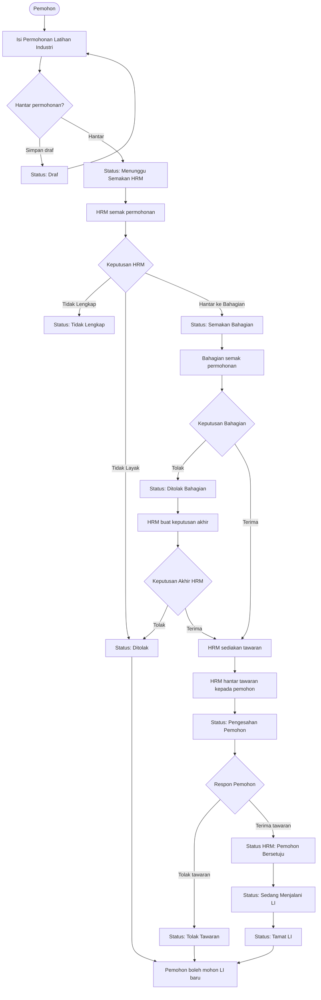
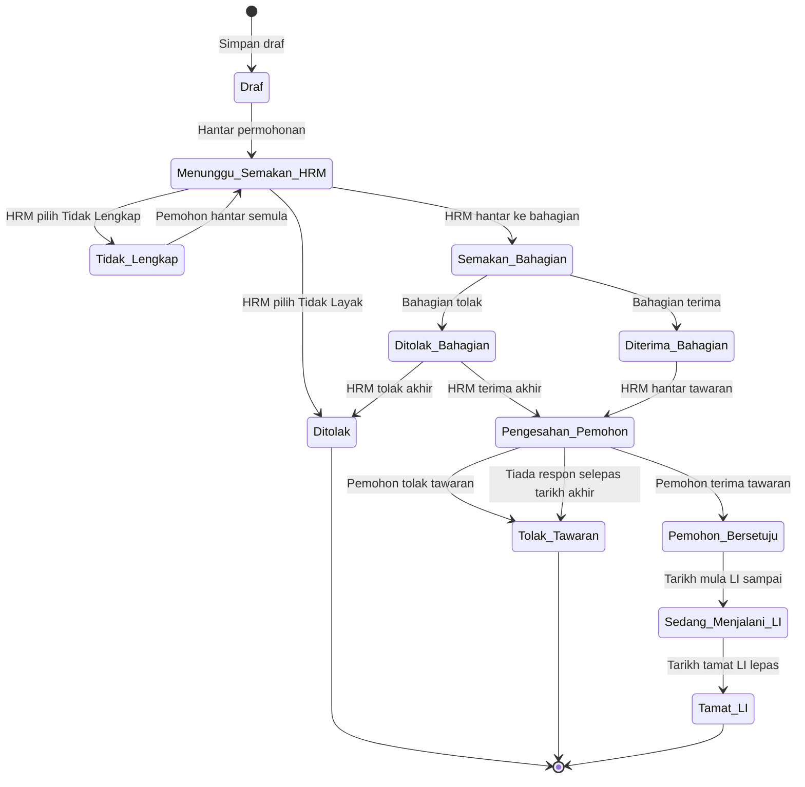
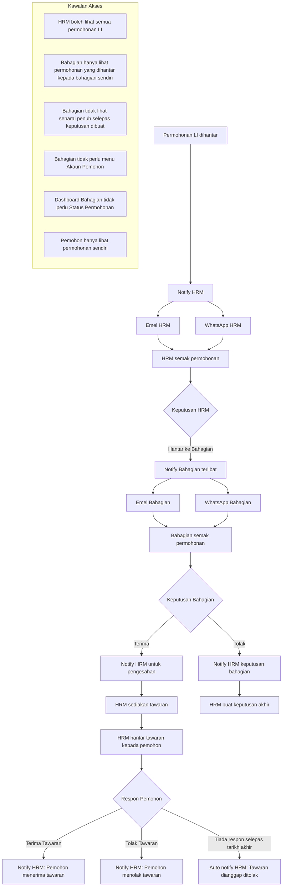
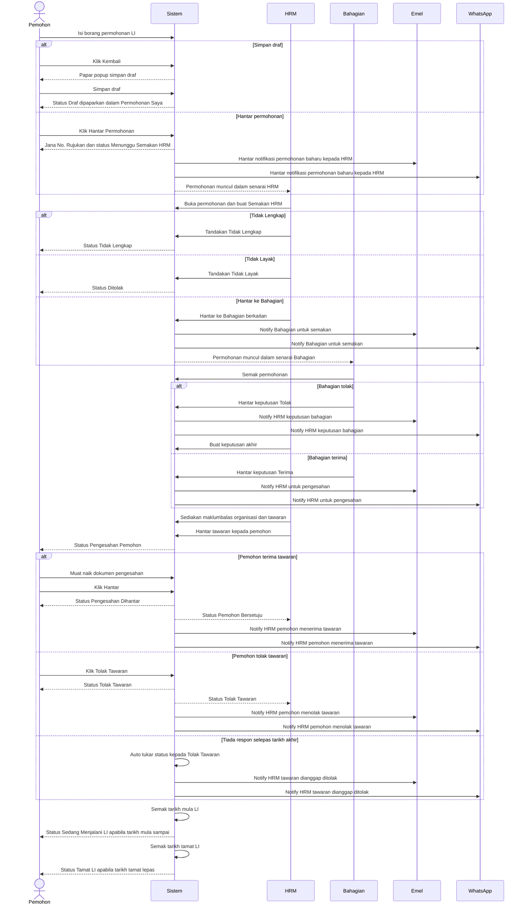

# Modul Permohonan Latihan Industri

Dokumen ini menyenaraikan lima rajah Mermaid untuk menerangkan aliran Modul Permohonan Latihan Industri DBKU.

## 1. Flow Ringkas Modul LI

## 2. Flow Lengkap Proses Permohonan LI

```mermaid
flowchart TD
  Start([Mula]) --> ApplyBtn[Klik Mohon Latihan Industri]
  ApplyBtn --> Eligibility{Ada permohonan LI aktif?}

  Eligibility -->|Ya| Block[Permohonan baru disekat]
  Block --> BlockReason[Draf / Menunggu semakan / Semakan bahagian / Tawaran / Sedang LI masih aktif]

  Eligibility -->|Tidak| Form[Borang Permohonan LI]
  Form --> Back{Klik Kembali sebelum hantar?}

  Back -->|Ya| DraftPopup[Popup simpan draf]
  DraftPopup --> DraftText[Maklumat yang telah diisi akan disimpan sebagai draf dan dipaparkan dalam Permohonan Saya.]
  DraftText --> SaveDraft[Simpan draf]
  SaveDraft --> DraftStatus[Status: Draf]
  DraftStatus --> ContinueDraft[Teruskan Draf]
  ContinueDraft --> Form

  Back -->|Tidak| Submit[Klik Hantar Permohonan]
  Form --> Submit
  Submit --> GenerateRef[No. Rujukan dijana]
  GenerateRef --> RefExample[Contoh: PK.2026-0003]
  RefExample --> SubmittedStatus[Status: Menunggu Semakan HRM]

  SubmittedStatus --> HRMReview[HRM buat Semakan HRM]
  HRMReview --> HRMDecision{Keputusan HRM}

  HRMDecision -->|Tidak Lengkap| Incomplete[Status: Tidak Lengkap]
  Incomplete --> ApplicantUpdate[Pemohon kemaskini permohonan]
  ApplicantUpdate --> SubmittedStatus

  HRMDecision -->|Tidak Layak| Rejected[Status: Ditolak]

  HRMDecision -->|Hantar ke Bahagian| SentDept[Status: Semakan Bahagian]
  SentDept --> DeptReview[Bahagian semak permohonan]
  DeptReview --> DeptDecision{Keputusan Bahagian}

  DeptDecision -->|Tolak| DeptRejected[Status: Ditolak Bahagian]
  DeptRejected --> HRMFinal[HRM buat keputusan akhir]
  HRMFinal --> FinalDecision{Keputusan Akhir HRM}
  FinalDecision -->|Tolak| Rejected
  FinalDecision -->|Terima| OrgFeedback

  DeptDecision -->|Terima| DeptAccepted[Status: Diterima Bahagian]
  DeptAccepted --> OrgFeedback[HRM sediakan Maklumbalas Organisasi]

  OrgFeedback --> UploadOffer[HRM muat naik dokumen tawaran]
  UploadOffer --> ReportDetails[Tetapkan tarikh, masa dan tempat melapor diri]
  ReportDetails --> ConfirmationDeadline[Tetapkan tarikh akhir pengesahan pemohon]
  ConfirmationDeadline --> SendToApplicant[Hantar ke Pemohon]

  SendToApplicant --> ApplicantConfirmation[Status: Pengesahan Pemohon]
  ApplicantConfirmation --> ResponseCheck{Pemohon respon sebelum tarikh akhir?}

  ResponseCheck -->|Tidak| AutoReject[Auto status: Tolak Tawaran]
  ResponseCheck -->|Ya| ApplicantChoice{Pilihan Pemohon}

  ApplicantChoice -->|Tolak Tawaran| RejectOffer[Status: Tolak Tawaran]
  ApplicantChoice -->|Terima Tawaran| UploadConfirm[Pemohon muat naik dokumen pengesahan]
  UploadConfirm --> SubmitConfirm[Klik Hantar]
  SubmitConfirm --> ApplicantSent[Status Pemohon: Pengesahan Dihantar]
  SubmitConfirm --> HRMAgreed[Status HRM: Pemohon Bersetuju]

  HRMAgreed --> StartDate{Tarikh mula LI sudah sampai?}
  StartDate -->|Belum| HRMAgreed
  StartDate -->|Ya| ActiveLI[Status: Sedang Menjalani LI]

  ActiveLI --> EndDate{Tarikh tamat LI sudah lepas?}
  EndDate -->|Belum| ActiveLI
  EndDate -->|Ya| Completed[Status: Tamat LI]

  Completed --> End([Selesai])
  Rejected --> End
  RejectOffer --> End
  AutoReject --> End
```

## 3. State Diagram Status Permohonan LI

## 4. Flow Notifikasi Dan Kawalan Akses

## 5. Sequence Diagram Permohonan LI

